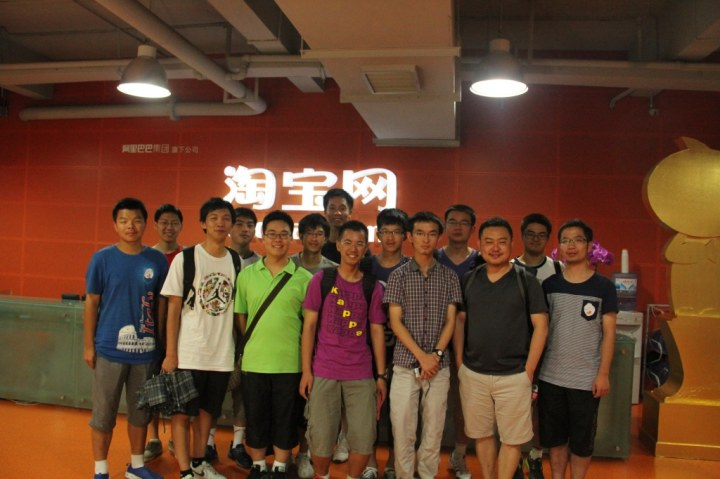

<html>
<head>
<title>中国IT版图调研实践主页 </title>
<link rel="stylesheet" href="./bootstrap/css/bootstrap.min.css">

</head>
<body>

	中国IT版图调研

	Loading Map...

	<button type="button" class="btn btn-success" onclick='showModal()'>支队简介</button>
	<a class="btn btn-info" role="button" href="categories.html">公司列表</a>

	

		

			

				</img>
				       浙江杭州中国IT版图调研支队是计算机系团委的精品实践支队。支队由计算机系、软件学院、物理系的15位同学构成，有着较强的专业背景。同时，由不同性别、年级、专业的同学组成也使得支队有着较强的综合能力。支队将在七天的时间内，走访包括阿里巴巴在内的多家IT企业，与杭州IT产业界的风云人物对话。通过采访和实地调研，还原一个真实的杭州IT发展状况，以更加了解计算机信息产业的时代前沿和发展前景，对今后有意投身IT产业的同学起到良好的导向作用。
			

		

	

</body>
</html>

